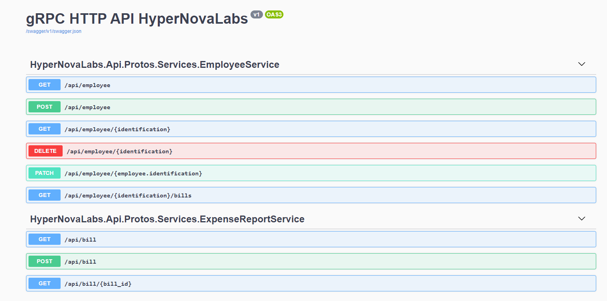

# HyperNovaLabs Technical Test

Demostración de un Sistema Web escrito en C++ WebAssembly con Emscripten y NoesisGUI,
con un Backend nativo en C++ gRPC y administrado en C# ASP .NET 5 gRPC.

## Herramientas Generales

* Instalar WSL2 :point_right: [Descargar](https://docs.microsoft.com/en-us/windows/wsl/install-win10)
* Instalar Docker Desktop :point_right: [Descargar](https://www.docker.com/products/docker-desktop)

### Windows

* Instalar Visual Studio Code :point_right: [Descargar](https://code.visualstudio.com/Download)
* Instalar CMake v3.21 o Mayor :point_right: [Descargar](https://cmake.org/download/)
* Instalar Emscripten v2.0.0 :point_right: [Descargar](https://emscripten.org/docs/getting_started/downloads.html)
* Instalar Ninja :point_right: [Descargar](https://ninja-build.org/)
* Instalar GNU-Make :point_right: [Descargar](https://www.gnu.org/software/make/)
* Instalar SDK Nativo de NoesisGUI :point_right: [Descargar](https://www.noesisengine.com/developers/downloads.php)
  - Crear licencia de prueba :point_right: [Crear](https://www.noesisengine.com/trial/)
    - Generar el binario ***NoesisApp.bc*** (WebAssembly) con la licencia de prueba :point_right: [Guía](https://www.noesisengine.com/docs/Gui.Core.Licensing.html)
* Instalar .Net 5: Viene integrado con Visual Studio 2019 por defecto

### Ubuntu/Linux

* Instalar **GCC**:***latest*** (build-essential) :point_right: [Guía](https://blog.arturofm.com/install-multiple-versions-of-gcc/)
* Instalar CMake v3.21 o Mayor :point_right: [Descargar](https://github.com/Kitware/CMake/releases)
* Instalar C++ gRPC v1.39.0 :point_right: [Guía](https://grpc.io/docs/languages/cpp/quickstart/)
* Instalar Ninja :point_right: [Descargar](https://github.com/ninja-build/ninja/releases)
* Instalar Microsoft ODBC driver for SQL Server (Linux) :point_right: [Guía](https://docs.microsoft.com/en-us/sql/connect/odbc/linux-mac/installing-the-microsoft-odbc-driver-for-sql-server?view=sql-server-ver15)

## Pasos para correr el proyecto: Frontend(C++) / Backend(C#)

* Abrir la solución de la carpeta ***HyperNovaLabsBackend***
* Ejecutar el proyecto: ***Docker-Compose***
* Abrir la consola de desarrollo de Visual Studio 2019 o Mayor
* Ejecutar los siguentes comandos
  - *dotnet tool install --global dotnet-ef*
  - *dotnet tool update --global dotnet-ef*
  - *dotnet ef database update --connection **"Server=host.docker.internal,5433;Initial Catalog=HyperNovaLabs.Api.ExpenseReport.Db;User Id=sa;Password=Pass@word"***
* Probar el Backend Administrado desde la vista Swagger
* Probar el Frontend

*Nota: Los números de puertos estan en el archivo docker-compose.override.yml*

## Pasos para correr el proyecto: Frontend/Backend en C++

* Ejecutar el archivo ***docker-compose.yml***
* Probar el Frontend

*Nota: El Backend esta escrito en gRPC sin soporte a HTTP/1*

## Descripción General Proyecto Frontend(C++)

*Nota 1: Este proyecto está configurado para usarse en Windows*

*Nota 2: El frontend aun esta en desarrollo, pronto se subirá la app de muestra*

* Compilador Emscripten :point_right: [Visitar](https://emscripten.org/)
* Lenguajes de Programación
  - C++
  - C#
* Lenguaje de Marcado
  - Xaml
* Editores
  - Visual Studio Code
  - Visual Studio 2019
  - Blend For Visual Studio 2019
* Herramientas de Compilación
  * CMake
  * Ninja
* Frameworks
  - NoesisGUI :point_right: [Visitar](https://noesisengine.com/)

## Descripción General Proyecto Backend(C++)

*Nota: Este proyecto está configurado para usarse en Linux o Windows con **WSL2***

* Compilador GCC/G++
* Lenguaje de Programación
  - C++
* Lenguaje de Definición de Interfaces
  - Protobuf
* Librerías
  - C++ Grpc :point_right: [Visitar](https://grpc.io/)

## Descripción General Proyecto Backend(C#)

*Nota: Este proyecto está configurado para usarse en Visual Studio*

* .Net 5 :point_right: [Visitar](https://dotnet.microsoft.com/download/dotnet/5.0)
* Lenguaje de Programación
  - C#
* Lenguaje de Definición de Interfaces
  - Protobuf

El Backend esta realizado mediante llamadas a procedimientos remotos.
Se le ha habilitado compatibilidad mediante Rest Api.

Los archivos de extensión ***.proto*** especifican el modelo interno del api.

### Puntos de Accesos

Vista Swagger: http://localhost:5785/swagger/index.html

1. GET: /api/employee
   * Obtiene una lista de todos los empleados.
2. POST: /api/employee
   * Crea un nuevo empleado.
3. GET: /api/employee/{identification}
   * Obtiene un empleado mediante una identificación.
4. DELETE: /api/employee/{identification}
   * Borra un empleado mediante su identificación.
5. PATH: /api/employee/{employee.identification}
   * Actualiza los datos de un empleado.
6. GET: /api/employee/{identification}/bills
   * Obtiene todas las facturas de un empleado existente.
7. GET: /api/bill
   * Obtiene una lista de todas las facturas.
8. GET: /api/bill/{bill_id}
   * Obtiene una factura por si Id.
9. POST: /api/bill
   * Crea una nueva factura.
